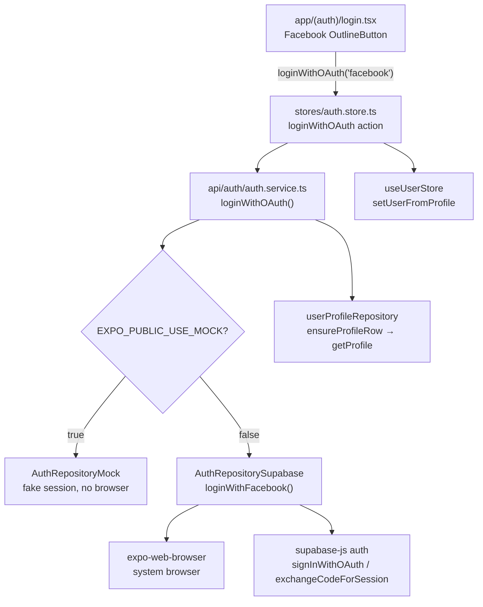
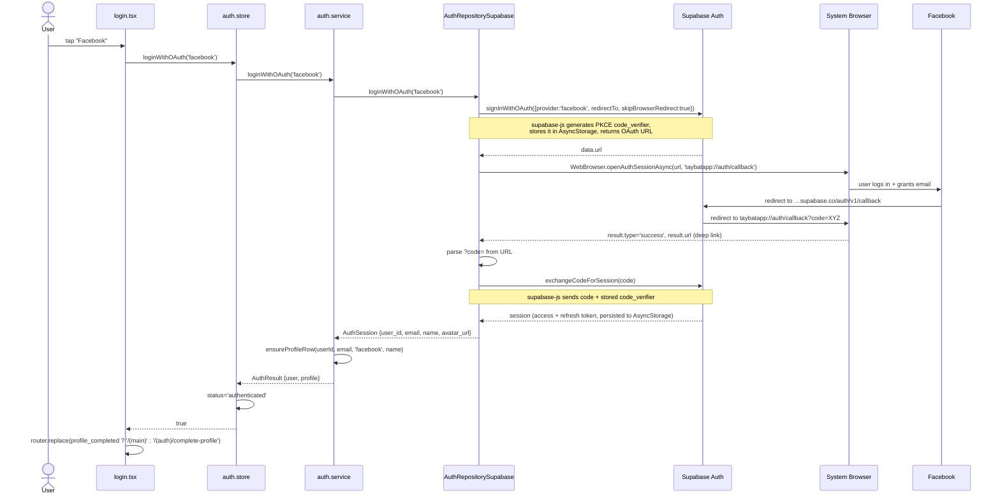
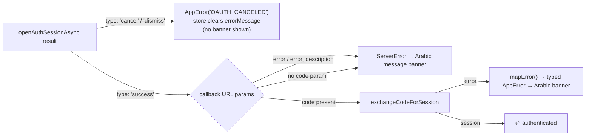

# Facebook Login — Technical Integration (Al-Taybat)

**Updated:** 2026-06-10 · **Flow:** Browser-based OAuth 2.0 + PKCE via Supabase
**Setup/config steps:** see [facebook_auth_setup_guide.md](facebook_auth_setup_guide.md)

---

## 1. Why this flow (vs. Google's)

| | Google (existing) | Facebook (this doc) |
|---|---|---|
| SDK | Native `@react-native-google-signin` | None — system browser |
| Supabase API | `signInWithIdToken(idToken)` | `signInWithOAuth` → `exchangeCodeForSession` |
| Secret in Supabase | Not needed | **Required** (App Secret) |
| Returns to app via | Native SDK callback | Deep link `taybatapp://auth/callback` |
| Extra requirement | Web Client ID env var | `flowType: 'pkce'` on the Supabase client |

Facebook has no Supabase-recommended native-token path for Expo, so we use the
documented React Native approach: open the Supabase-generated OAuth URL in the
system browser and exchange the returned authorization code for a session.

---

## 2. Layered Architecture (unchanged — Facebook plugs into existing seams)



Only **one method** was added for Facebook: `AuthRepositorySupabase.loginWithFacebook()`.
Everything above it (store, service, UI button, `AuthProvider` type, mock) already
supported `'facebook'`.

---

## 3. Sequence Diagram — Happy Path



### Cancel / failure paths



`OAUTH_CANCELED` is treated specially in [stores/auth.store.ts:139](../../../stores/auth.store.ts#L139):
a user-initiated cancel shows **no** error banner; real failures show the mapped
Arabic message.

---

## 4. Files Changed

| File | Change |
|---|---|
| [lib/supabase.ts](../../../lib/supabase.ts) | Added `flowType: 'pkce'` — required by `exchangeCodeForSession`. Email/password, OTP and Google `signInWithIdToken` are unaffected. |
| [repositories/auth/AuthRepositorySupabase.ts](../../../repositories/auth/AuthRepositorySupabase.ts) | `loginWithOAuth` now routes `'facebook'` → new private `loginWithFacebook()` (PKCE browser flow, step-by-step debug logging like the Google flow). |
| [.env.example](../../../.env.example) | Comment clarifying Facebook needs no env var. |
| `package.json` | Added `expo-web-browser` (native module — requires a dev-client rebuild). |

Already in place before this change (no edits needed):

- `'facebook'` in `AuthProvider` ([types/auth.types.ts:1](../../../types/auth.types.ts#L1))
- Facebook button on the login screen ([app/(auth)/login.tsx:351-356](../../../app/(auth)/login.tsx#L351-L356)) — rendered only when `EXPO_PUBLIC_USE_MOCK=false`
- Store action `loginWithOAuth('facebook')`, service orchestration, mock repo, `OAUTH_CANCELED` error code, `scheme: "taybatapp"` in `app.json`

---

## 5. Key Implementation Details

### PKCE — why and how it works here

The mobile app is a *public client* — it can't hold the Facebook App Secret.
PKCE (Proof Key for Code Exchange) protects the code exchange instead:

1. `signInWithOAuth(..., skipBrowserRedirect: true)` — supabase-js creates a random
   `code_verifier`, saves it in AsyncStorage, embeds its hash in the OAuth URL, and
   returns the URL **without opening anything** (we control the browser).
2. The deep link comes back with a one-time `?code=`.
3. `exchangeCodeForSession(code)` sends `code + code_verifier` to Supabase, which
   verifies the pair and returns the session. A stolen `code` alone is useless.

The Facebook **App Secret** is only used server-side between Supabase and Facebook —
it never reaches the device.

### Dynamic import of `expo-web-browser`

```ts
const WebBrowser = await import('expo-web-browser');
```

Same pattern as the Google SDK import: the native module is only evaluated when the
user actually taps Facebook. Mock mode and dev clients built before the package was
added never touch it, so they can't crash at startup.

### Profile provisioning (shared with all providers)

`authService.ensureProfileRow(userId, email, 'facebook', name)` creates the
`user_profiles` row on first login with `profile_completed: false`, which routes the
user to **complete-profile**. Subsequent logins find the existing row and go straight
to main. Facebook's display name and avatar come from `session.user.user_metadata`
(`name`/`full_name`, `avatar_url`/`picture`) via `toSession()`.

### Error mapping

All Supabase/Facebook errors funnel through `mapError()` →
typed `AppError` subclasses → Arabic `toUserMessage()` strings. Raw provider errors
are logged (`createLogger('Auth')`) but never shown to the user.

---

## 6. Constraints & Gotchas

- **Rebuild required once:** `expo-web-browser` is native — run
  `npx expo run:android` / `run:ios` after pulling this change.
- **Dev Mode lockout:** until the Meta app is Live, only listed Testers can log in
  (everyone else sees "App not active" *inside the browser* — that is a Meta-side
  config issue, not an app bug).
- **Deep link allowlist:** `taybatapp://auth/callback` must exist in Supabase →
  Auth → URL Configuration, or the browser succeeds but never returns to the app.
- **`detectSessionInUrl: false`** stays false — we parse the callback manually;
  automatic detection is a web-only behavior.
- **Email can be null** if the Facebook account has no confirmed email or the user
  denies the email permission. `ensureProfileRow` would then receive
  `session.email = undefined` → service falls back to `mock+facebook@taybat.app`;
  acceptable for now, revisit if real users hit it.

---

## 7. Manual Test Plan

| # | Step | Expected |
|---|---|---|
| 1 | `EXPO_PUBLIC_USE_MOCK=false`, rebuild, tap Facebook | System browser opens Facebook login |
| 2 | Close the browser sheet | Back on login, **no** error banner |
| 3 | Login with Tester account, grant email | Returns to app → complete-profile |
| 4 | Finish profile, logout, login with Facebook again | Straight to main, same user row |
| 5 | Supabase → Auth → Users | Provider `facebook`, email populated |
| 6 | `EXPO_PUBLIC_USE_MOCK=true` | Facebook button hidden; mock OAuth path unaffected |
| 7 | `npm run typecheck && npm run lint` | Clean ✅ (verified 2026-06-10) |
