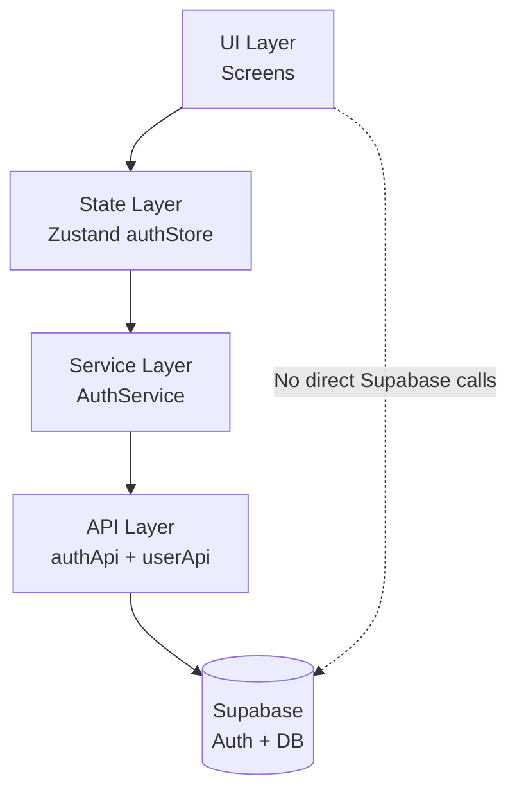
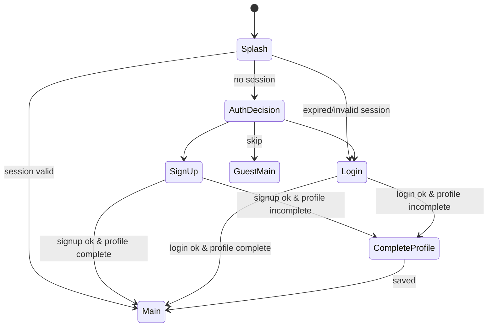
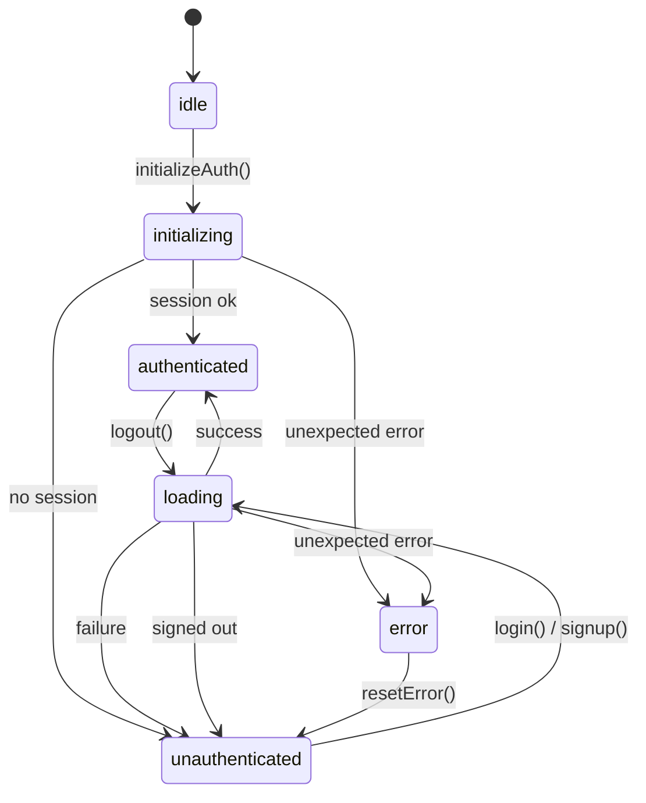
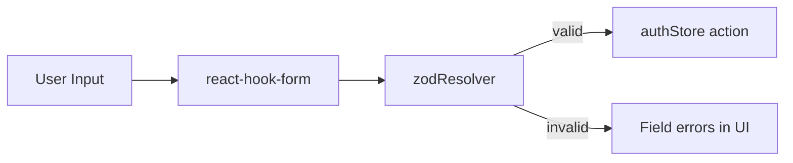
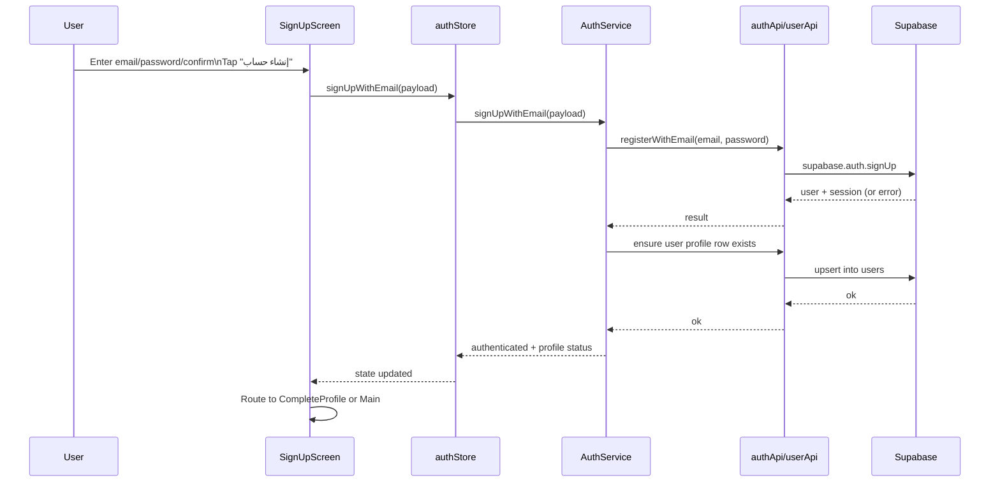
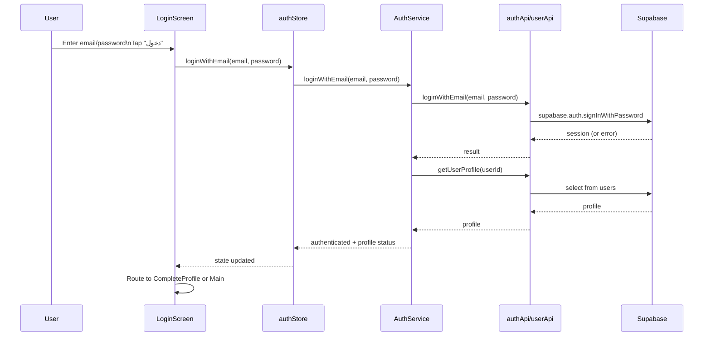
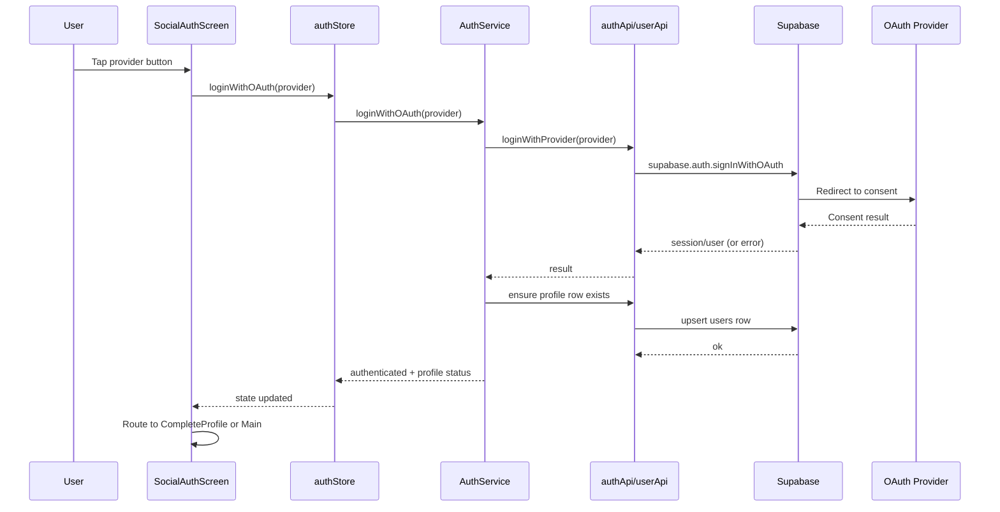
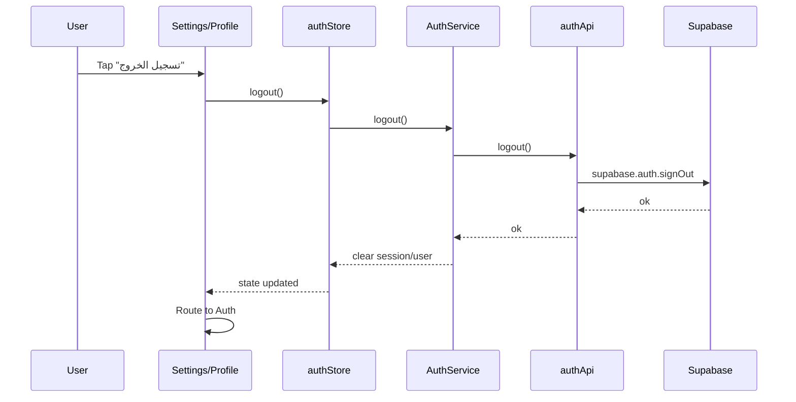
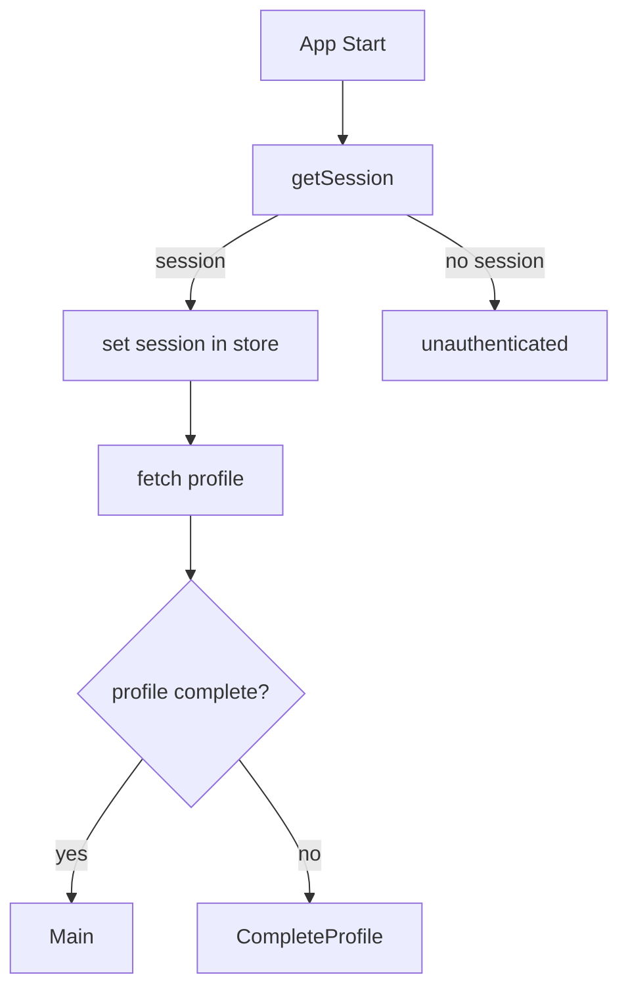

# Auth (Login & Sign Up) — Technical Document (Al‑Taybat)

This document is derived from: `TAYBAT_TECHNICAL_IMPLEMENTATION_PLAN.md` and focuses only on Login + Sign Up for the mobile app (Supabase Auth + Zustand + Service/API layers), with RTL-first Arabic UX.

---

## Scope

- Login: Email/Password, OAuth (Google, Facebook, Apple)
- Sign Up: Email/Password, OAuth (Google, Facebook, Apple)
- Session restore on app start (Splash)
- Post-auth routing to profile completion (CompleteProfile) when needed
- Guest mode (“Skip for now”) with limited access

Out of scope:
- Subscription/payment flows
- Full onboarding content (except where it links to auth)
- Meal preferences, analytics, and main feature flows

---

## Layered Architecture (Auth)

**Key rule**: Screens collect input + display loading/error only; all async auth work is done through store actions → services → API modules.

---

## Screens & UX Requirements

### 1) Splash
- Shows branding + loader.
- Restores session (`getSession`) and routes:
  - Valid session → Main
  - No session → Auth
  - Expired/invalid → Login

### 2) Auth Decision
- Buttons:
  - إنشاء حساب (Sign Up)
  - لدي حساب بالفعل (Login)
  - تصفح التطبيق أولاً (Skip/Guest)

### 3) Sign Up
Options:
- Continue with Google
- Continue with Facebook
- Continue with Apple
- Create account with Email/Password (with Confirm Password)

After success:
- If profile incomplete → CompleteProfile
- Else → Main

### 4) Login
Options:
- Email/Password
- OAuth buttons (same providers)

Links:
- لا تملك حساباً؟ (Go to Sign Up)
- نسيت كلمة المرور؟ (Password reset)

### 5) Complete Profile (post-auth)
Multi-step profile completion after account creation (OAuth or Email):
- Basic info → Health info → Complaints → Goal

---

## Navigation Flow

---

## Authentication State Machine (Store-Level)

---

## Data Model (Minimum)

- **Supabase auth user**: comes from `supabase.auth.*`
- **App profile**: stored in `users` table

Recommended “profile completeness” flags:
- `users.profile_completed: boolean`
- Or computed by required fields presence (name, age, weight, …)

---

## API Layer (Supabase wrapper)

Auth-related API functions (from the plan):
- `registerWithEmail(email, password)` → `supabase.auth.signUp`
- `loginWithEmail(email, password)` → `supabase.auth.signInWithPassword`
- `loginWithGoogle/Facebook/Apple()` → `supabase.auth.signInWithOAuth({ provider })`
- `logout()` → `supabase.auth.signOut`
- `getSession()` → `supabase.auth.getSession`

User profile API functions:
- `completeProfile(userId, profileData)` → `supabase.from('users').update(profileData).eq('id', userId)`
- `getUserProfile(userId)` → `supabase.from('users').select('*').eq('id', userId).single()`

---

## Service Layer Responsibilities (AuthService)

AuthService is responsible for:
- Orchestrating auth calls through `authApi`
- Creating/ensuring user profile row after sign up (insert/update)
- Fetching profile after login
- Determining next route (Main vs CompleteProfile)
- Mapping all errors to user-friendly Arabic messages

---

## Store Layer Responsibilities (authStore)

Store state (minimum):
- `user`: authenticated user identity (or null)
- `session`: access token + refresh token (or null)
- `isLoading`
- `errorMessage`

Store actions (recommended set):
- `initializeAuth()`
- `loginWithEmail(email, password)`
- `signUpWithEmail(email, password, confirmPassword)`
- `loginWithOAuth(provider)`
- `logout()`
- `resetAuth()`
- `clearError()`

Persist only what is needed (usually session/token + minimal user identity). Avoid persisting UI-only state.

---

## Validation (Zod + React Hook Form)

From the plan:
- Email must be valid email
- Password min 8 chars
- Confirm password matches

Recommended:
- Login schema: email + password
- Sign up schema: email + password + confirmPassword

---

## Error Handling (User-Friendly Arabic)

Core mapping (from the plan):
- “User already registered” → البريد الإلكتروني مستخدم بالفعل
- “Invalid login” → البريد أو كلمة المرور غير صحيحة
- Fallback → حدث خطأ ما. حاول لاحقاً

Also handle:
- Network offline / timeout
- OAuth canceled by user
- Session expired during app use (force re-login + show message)

---

## Auth Sequences (Diagrams)

### Email Sign Up

### Email Login

### OAuth Login / Sign Up (Google/Facebook/Apple)

### Logout

---

## Session Restore & Listener

### Restore on Splash
- `authApi.getSession()` determines initial route.

### Auth State Change Listener (recommended)
- Subscribe to auth changes so session updates propagate across the app:
  - `SIGNED_IN` → set session + fetch profile
  - `SIGNED_OUT` → clear auth + route to Auth
  - `TOKEN_REFRESHED` → update session token

---

## Guest Mode (Skip for Now)

Rules from the plan:
- Allowed: Library, sample meal plans, “How it works”
- Blocked: meal tracking, analytics, personalized recommendations
- Persistent CTA: “اكتمل ملفك الآن”
- Completing profile later routes through auth + complete profile screens

---

## Localization & RTL Notes

- Arabic is default language.
- Text alignment and layout should assume RTL first.
- All user-facing strings must come from i18n keys (avoid hardcoded text in UI).

Suggested i18n key groups:
- `auth.login.title`, `auth.login.email`, `auth.login.password`, `auth.login.submit`
- `auth.signup.title`, `auth.signup.submit`, `auth.signup.confirmPassword`
- `auth.oauth.continueWithGoogle`, `auth.oauth.continueWithApple`, …
- `auth.errors.invalidLogin`, `auth.errors.emailInUse`, `auth.errors.generic`

---

## Security & Privacy Requirements

- Never log tokens or auth responses containing secrets.
- Enforce password constraints client-side + rely on Supabase rules server-side.
- Ensure database writes use RLS (Row Level Security) to restrict profiles to their owners.
- Handle “email confirmation required” if enabled in Supabase:
  - After sign up, show “تحقق من بريدك الإلكتروني” and allow resend.

---

## Testing Checklist (Auth)

Minimum coverage:
- Unit: error mapping utility (pure)
- Service tests: login/signup success, known error cases, profile incomplete routing decision
- Integration: store action updates state correctly on success/failure

Manual QA (RTL):
- Alignment of fields, icons, and back gestures in RTL
- Long Arabic strings don’t clip
- Loading and error messages displayed correctly

