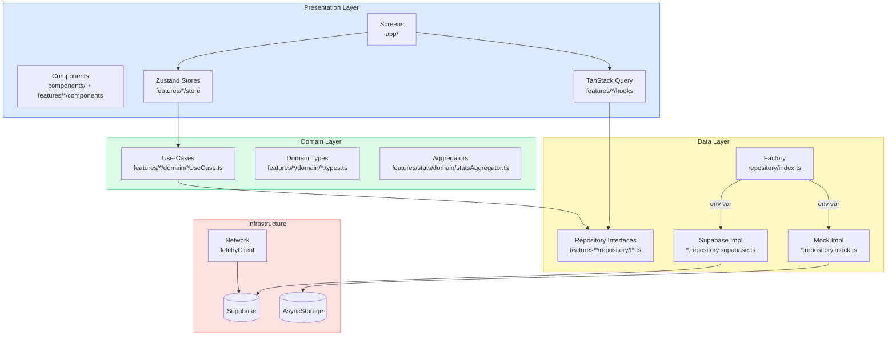
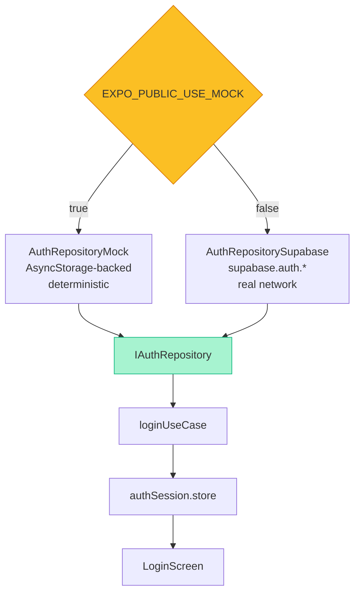
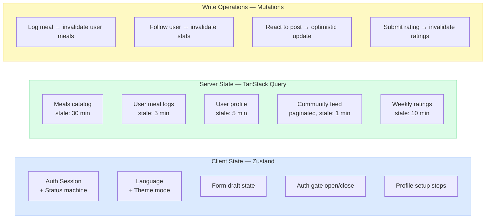
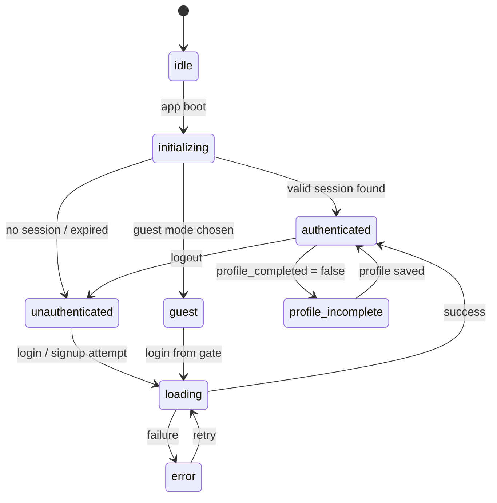
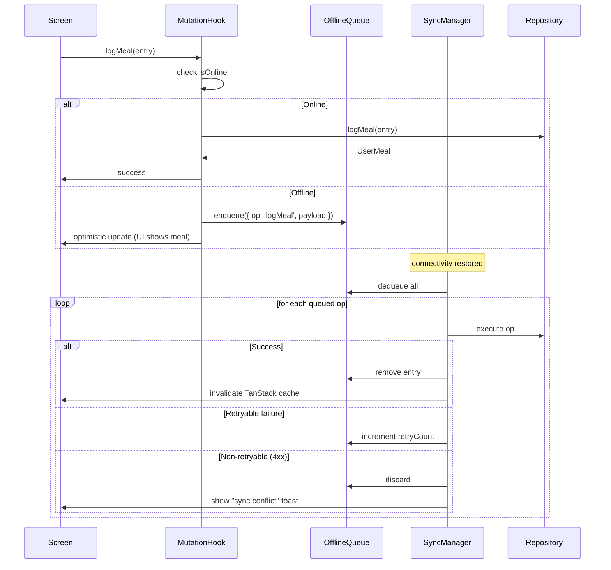
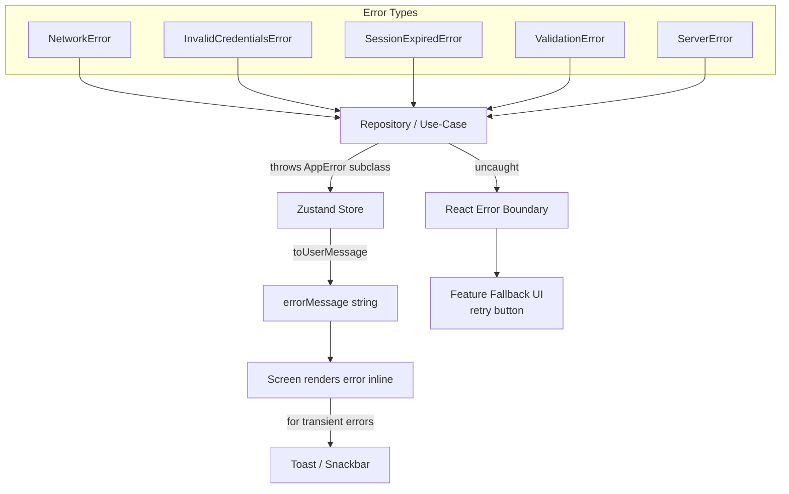
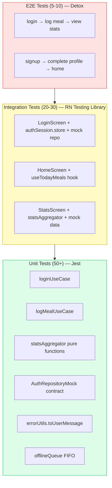
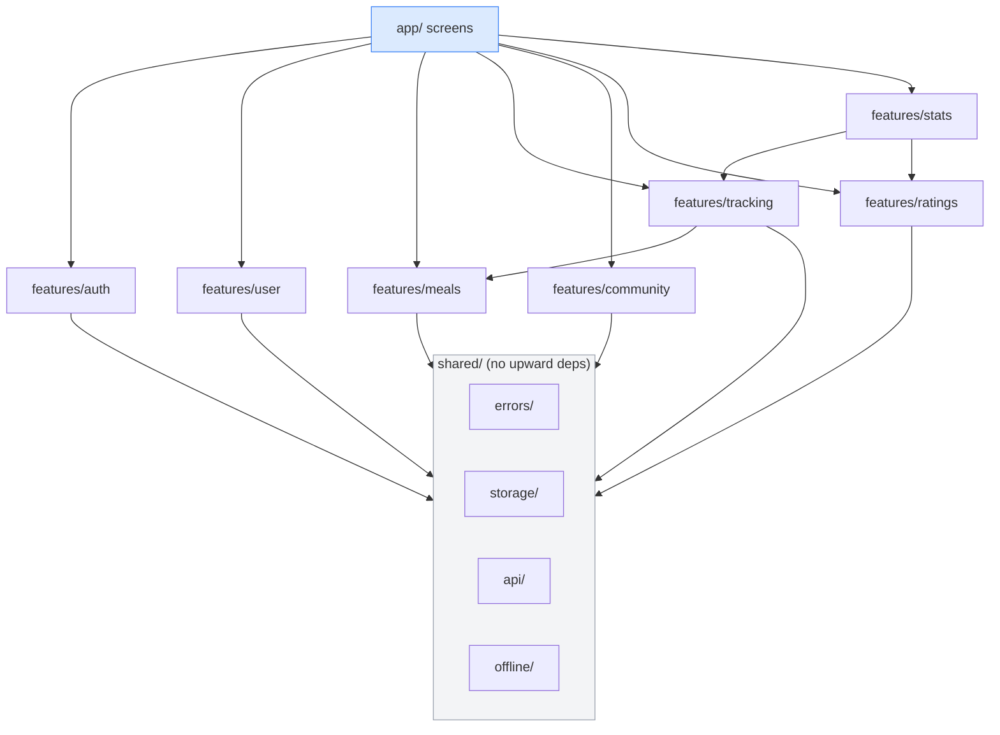

# 06 — Architecture Diagrams

All diagrams use [Mermaid](https://mermaid.js.org/) syntax — renderable in GitHub, Obsidian, VS Code, and most Markdown viewers.

---

## D1 — System Layers (Clean Architecture)



---

## D2 — Feature Vertical Slice (Auth Example)

```mermaid
graph LR
    subgraph app["app/(auth)/login.tsx"]
        LS[LoginScreen]
    end

    subgraph store["features/auth/store/"]
        AS[authSession.store.ts]
    end

    subgraph domain["features/auth/domain/"]
        LU[loginUseCase.ts]
        VL[auth.schemas.ts - zod]
    end

    subgraph repo["features/auth/repository/"]
        IRI[IAuthRepository.ts]
        MOCK[auth.repository.mock.ts]
        SUP[auth.repository.supabase.ts]
        FAC[index.ts - factory]
    end

    subgraph infra["Infrastructure"]
        SS[storageService]
        SBC[supabaseClient]
    end

    LS -->|useAuthSessionStore| AS
    AS -->|loginUseCase(repo, payload)| LU
    LU -->|validate| VL
    LU -->|repo.login()| IRI
    FAC -->|implements| MOCK
    FAC -->|implements| SUP
    MOCK --> SS
    SUP --> SBC
    IRI -.->|interface| FAC
```

---

## D3 — Repository Swap Mechanism



---

## D4 — State Ownership (Zustand vs TanStack Query)



---

## D5 — Auth State Machine



---

## D6 — Offline Operation Queue



---

## D7 — Error Handling Flow



---

## D8 — Stats / Charts Data Flow

```mermaid
flowchart LR
    subgraph Data Sources
        RK[useUserMeals<br/>TanStack Query]
        RR[useRatings<br/>TanStack Query]
    end

    subgraph Aggregation
        AGG[statsAggregator.ts<br/>pure functions]
    end

    subgraph Chart Data
        WT[weeklyTrend<br/>DailySummary array]
        ZD[zoneDistribution<br/>ZoneDistribution]
        RT[ratingTrend<br/>RatingPoint array]
    end

    subgraph Components
        LC[AdherenceLineChart]
        DC[ZoneDonutChart]
        BC[WeeklyBarChart]
    end

    RK -->|meals: UserMeal[]| AGG
    RR -->|ratings: WeeklyRating[]| AGG
    AGG --> WT --> LC
    AGG --> ZD --> DC
    AGG --> RT --> BC
```

---

## D9 — Test Pyramid



---

## D10 — Feature Dependency Graph (Target)



Features may only import from `shared/`. The only allowed cross-feature dependency is `tracking` → `meals` (tracking needs meal types) and `stats` → `tracking` + `ratings` (aggregation input). All others are forbidden.

---

## D11 — Folder Anatomy of One Feature

```
features/auth/
│
├── domain/               Pure business logic — no React, no Supabase
│   ├── auth.types.ts     AuthSession, AuthUser, LoginPayload, SignupPayload
│   ├── auth.schemas.ts   Zod schemas for validation
│   ├── loginUseCase.ts   Orchestrates: validate → repo.login()
│   ├── signupUseCase.ts
│   ├── logoutUseCase.ts
│   └── initSessionUseCase.ts
│
├── repository/           Data access — one interface, two implementations
│   ├── IAuthRepository.ts        ← contract
│   ├── IUserProfileRepository.ts
│   ├── auth.repository.mock.ts   ← AsyncStorage-backed
│   ├── auth.repository.supabase.ts ← supabase.auth.*
│   ├── userProfile.repository.mock.ts
│   ├── userProfile.repository.supabase.ts
│   └── index.ts                  ← factory (picks impl from env)
│
├── store/                Zustand — narrow slices
│   ├── authSession.store.ts   Status machine + session
│   ├── profileSetup.store.ts  Multi-step form state
│   └── authGate.store.ts      UI: gate sheet open/close
│
├── hooks/                React Query + thin store wrappers
│   ├── useAuthSession.ts     thin selector wrapper
│   └── useAuthGate.ts        requireAuth() logic
│
└── components/           Auth-specific UI — dumb, props-only
    ├── SocialAuthButtons.tsx
    ├── AuthGateSheet.tsx
    ├── ProfileStepBasic.tsx
    ├── ProfileStepHealth.tsx
    └── ProfileStepGoals.tsx
```

This pattern repeats for every feature. A new developer can open `features/community/` and understand the entire community feature without reading anything else.
